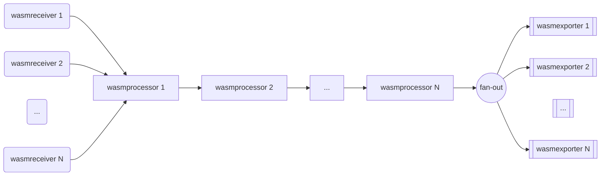
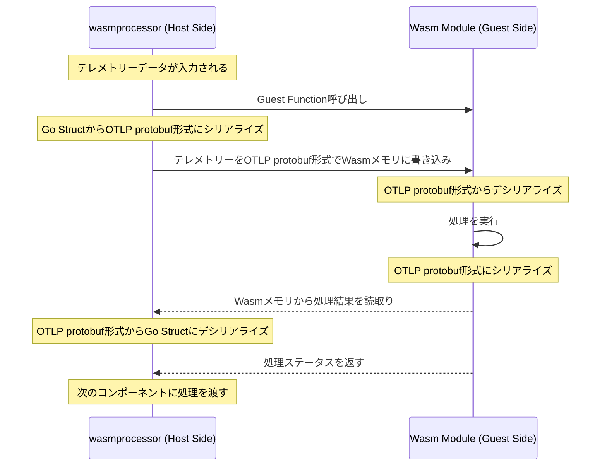

# OTelWasm

Project Status: **Experimental**

This project is a PoC for a WebAssembly (Wasm) based OpenTelemetry Collector plugins. It is not intended for production use, and it may include breaking changes without notice.

## Acknowledgements

This project originally started by Anuraag (Rag) Agrawal (@anuraaga). Most of the code and design is based on [his prior work](https://github.com/open-telemetry/opentelemetry-collector-contrib/issues/11772).

This project also leverages the work of the [kube-scheduler-wasm-extension](https://github.com/kubernetes-sigs/kube-scheduler-wasm-extension) project, which is a great example of how to use WebAssembly as a runtime for plugin.

## Architecture

### wasmprocessor

### wasmreceiver

### wasmexporter
