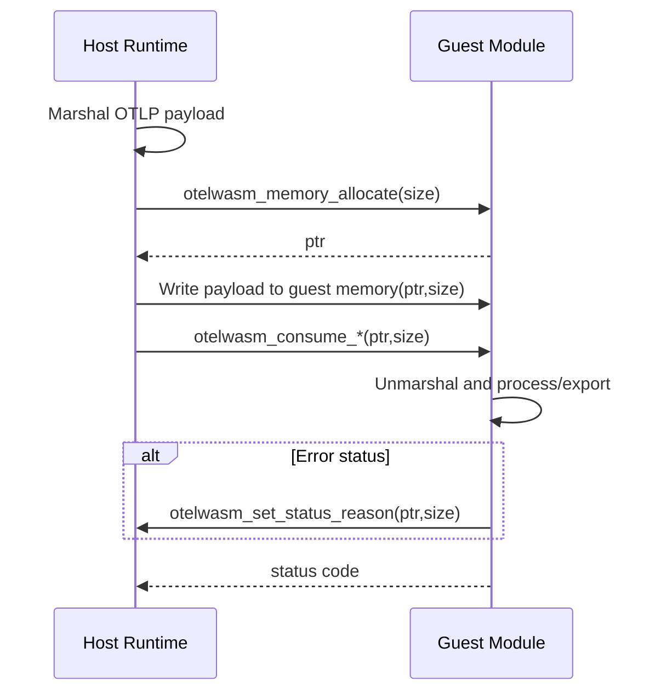
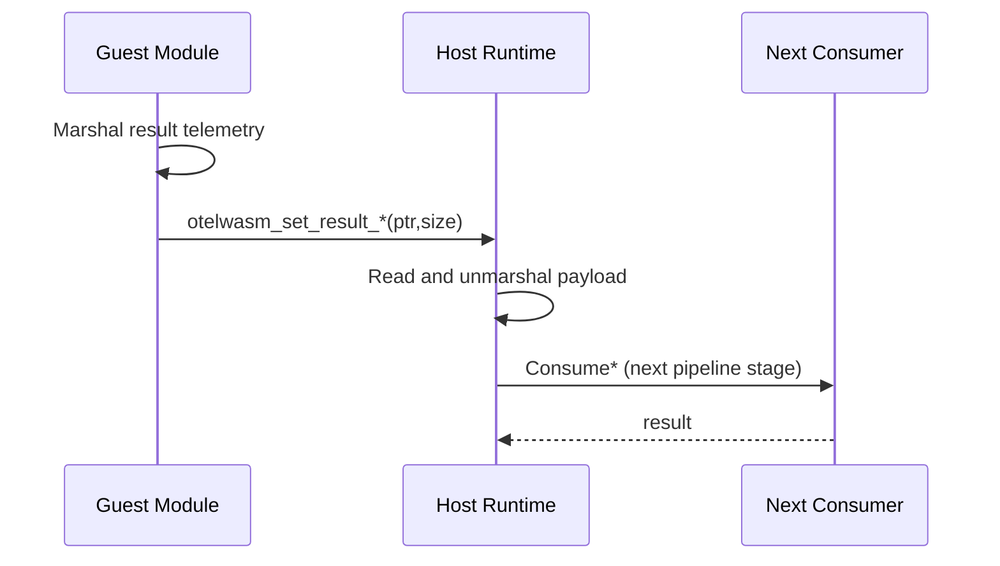
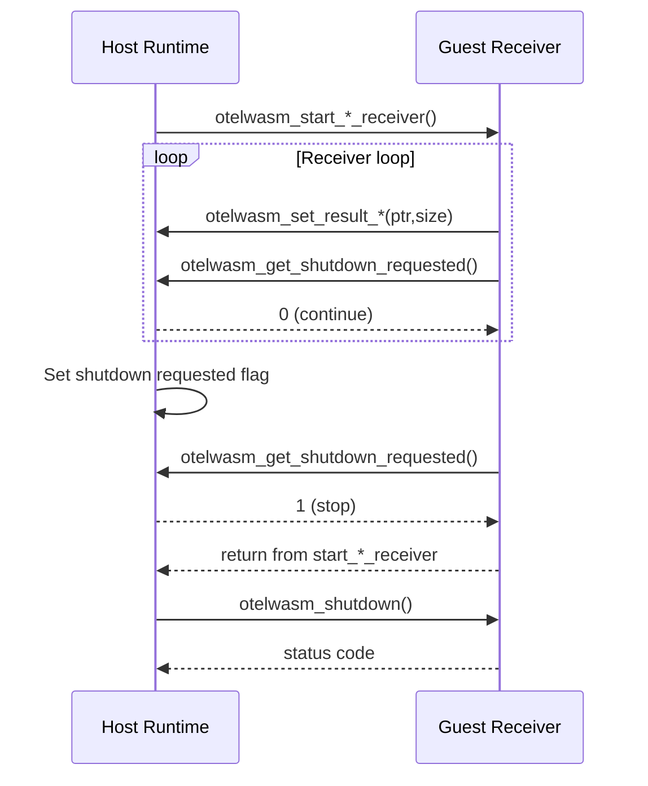
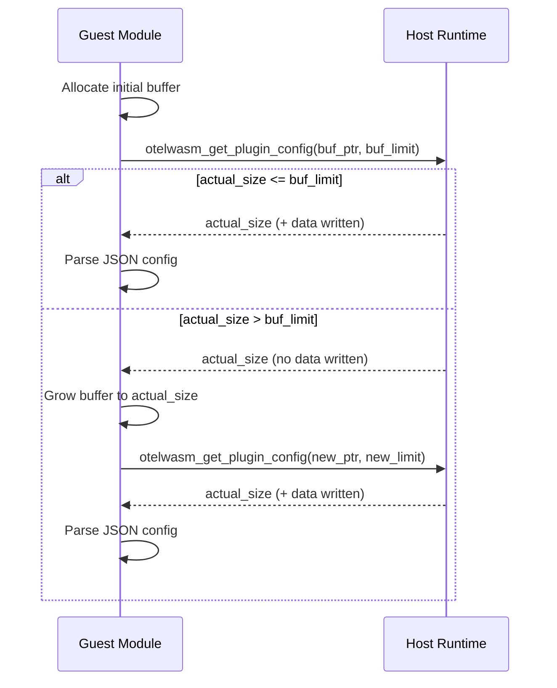

# ABI v1 Rationale

This document explains why ABI v1 in otelwasm is designed the way it is, and how data flows between host and guest.

## Design Decisions

### 1. Prefix all non-WASM/WASI ABI symbols with `otelwasm_`

Custom ABI symbols are prefixed (for example `otelwasm_consume_traces`, `otelwasm_start`, `otelwasm_set_result_traces`) to:

- avoid collisions with runtime/toolchain exports
- make ownership clear (`otelwasm` ABI vs WASM/WASI standard symbols)
- simplify static inspection of ABI compliance

### 2. Use an ABI marker export

`otelwasm_abi_version_0_1_0` is exported as a marker function.

- host can detect ABI support by checking export existence
- no runtime call is required
- future versions can coexist via additional markers

### 3. Push model for telemetry payloads

Host serializes telemetry and pushes bytes into guest memory:

1. host calls `otelwasm_memory_allocate(size)`
2. host writes payload into guest linear memory
3. host calls `otelwasm_consume_{traces|metrics|logs}(ptr, size)`

Why push:

- aligns with Collector consumer shape (host-driven delivery)
- easier for multi-language guest SDKs (Rust/Zig/Go)
- avoids pull-model round trips (`current*` style callbacks)

### 4. Guest-owned memory lifecycle

Allocation is guest-side (`otelwasm_memory_allocate`) and ownership stays with guest.

- no host-side `free`/`dealloc` ABI is required
- guest can choose GC/RAII/manual strategy
- keeps ABI surface smaller

### 5. Explicit lifecycle exports

Lifecycle uses `otelwasm_start` and `otelwasm_shutdown`.

- directly maps to Collector component lifecycle semantics
- keeps startup/shutdown behavior explicit
- provides a consistent boundary across processor/exporter/receiver plugins

### 6. Explicit telemetry capability negotiation

`otelwasm_get_supported_telemetry` returns signal bitmask.

- host validates required signals before execution
- plugin load failures happen early and clearly

### 7. Status + reason split for errors

Guest returns numeric status codes and can set human-readable reason via `otelwasm_set_status_reason`.

- stable machine-level contract (`i32` status)
- optional diagnostic detail for logs/troubleshooting

### 8. Receiver shutdown as host-observed flag

Receivers are long-running and poll `otelwasm_get_shutdown_requested`.

- host controls termination timing
- receiver loops can stop gracefully without ad-hoc traps

## Data Flow

### A. Host -> Guest (processor/exporter consume path)

1. Host marshals telemetry to OTLP protobuf bytes.
2. Host calls `otelwasm_memory_allocate(len(payload))`.
3. Host writes payload to guest memory at returned pointer.
4. Host calls `otelwasm_consume_*`.
5. Guest unmarshals and processes/exports.
6. Guest returns status code (`0` success, non-zero error).
7. If non-zero, host may read previously set reason (`otelwasm_set_status_reason`).

### B. Guest -> Host (forwarding result to next consumer)

For processor/receiver output:

1. Guest marshals resulting telemetry to OTLP protobuf bytes.
2. Guest calls `otelwasm_set_result_{traces|metrics|logs}(ptr, size)`.
3. Host reads bytes from guest memory.
4. Host unmarshals and forwards to the next Collector consumer.

### C. Configuration read (buffer-passing pattern)

1. Guest allocates local buffer.
2. Guest calls `otelwasm_get_plugin_config(buf_ptr, buf_limit)`.
3. Host returns actual size (and writes if buffer was large enough).
4. Guest retries with larger buffer if needed.

### D. Receiver run loop

1. Host starts receiver by calling `otelwasm_start_*_receiver`.
2. Guest loop emits data via `otelwasm_set_result_*`.
3. Guest periodically polls `otelwasm_get_shutdown_requested`.
4. Host sets shutdown flag; guest exits loop.
5. Host calls `otelwasm_shutdown`.

## Sequence Diagrams

### 1. Host -> Guest Consume Path

### 2. Guest -> Host Forwarding Path

### 3. Receiver Loop and Graceful Shutdown

### 4. Configuration Read (Buffer-Passing Retry)

## Compatibility Stance for v1 (Current)

ABI v1 is still pre-stable in this repository, so consistency is prioritized over compatibility shims:

- canonical names are `otelwasm_*`
- legacy alias support is intentionally minimized/removed where possible
- modules should be rebuilt against the current ABI contract
